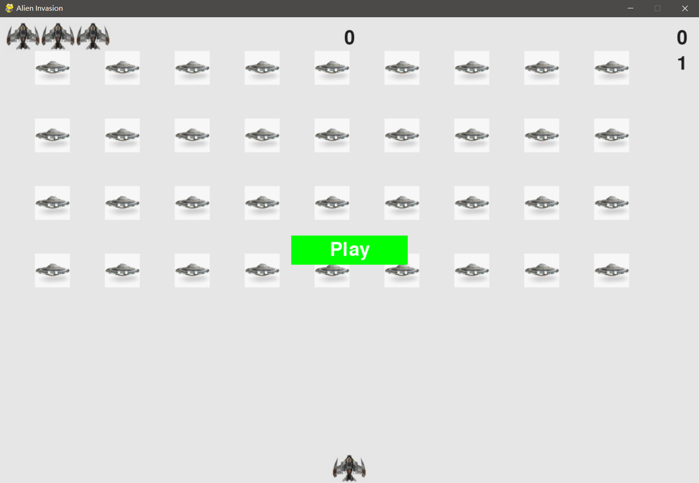
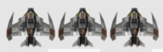
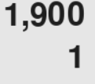
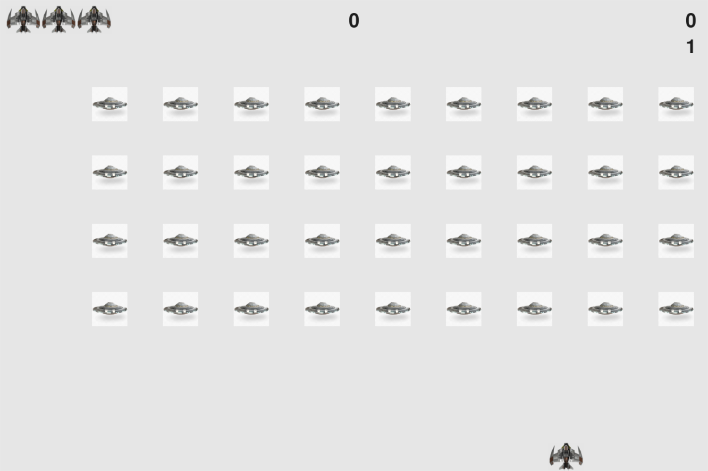
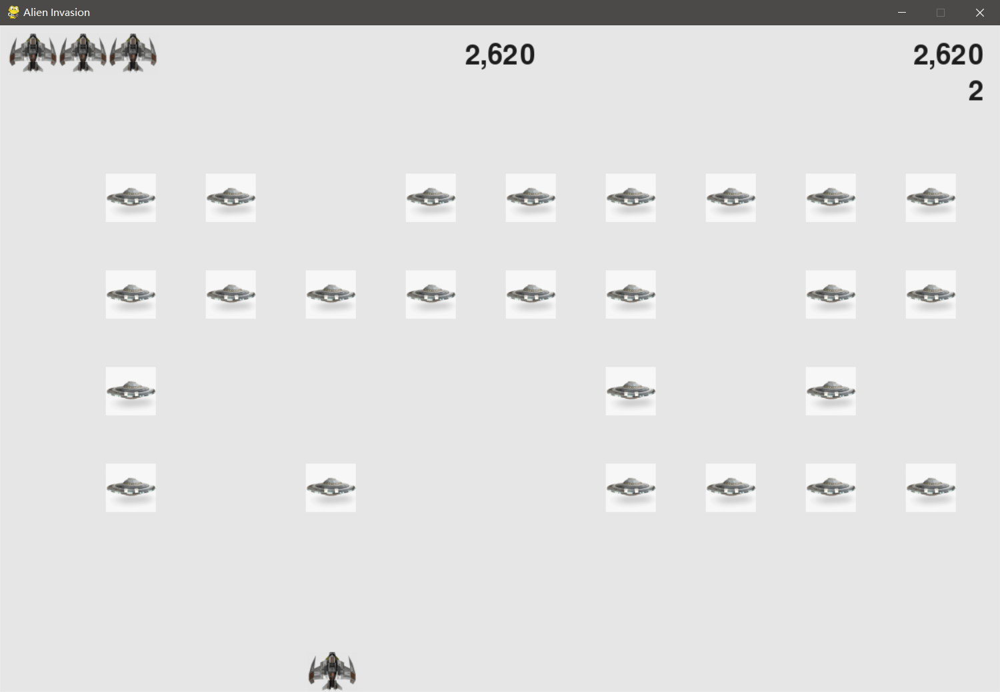

# 《Python程序设计基础》程序设计作品说明书

题目： 外星人入侵游戏👽

学院： 21计科01

姓名： 杨镇泽

学号： B20210302132

指导教师： 周景

起止日期：2023.11.10-2023.12.10

## 摘要

_《外星人入侵游戏》是一款基于Python编程语言和Pygame库开发的2D射击游戏。玩家需要驾驶飞船与入侵的外星人展开激烈对抗，游戏背景设定在太空。通过巧妙设计的游戏机制、精美的图形和简单直观的操作方式，提供了充满挑战和娱乐的游戏体验。项目中使用Python建立了游戏的基本框架，并借助Pygame库处理游戏中的图形、声音等功能。详细介绍了飞船和外星人的设计与实现，以及包括子弹、分数计算在内的各种元素。游戏通过设计良好的游戏循环，实现了持续进行，直到玩家胜利或失败。我完成了游戏项目的整体设计和编码工作，包括创建游戏窗口、定义飞船和外星人的属性与行为、处理用户输入以及实现游戏逻辑循环等。并通过调试和优化确保游戏的流畅运行和良好的用户体验。_

关键词：《外星人入侵游戏》Python Pygame

## 第1章 需求分析

功能：
1. 游戏窗口创建：创建一个游戏窗口用于游戏展示。
2. 飞船图像添加：在游戏窗口中添加飞船图像，让玩家能够看到飞船。
3. 驾驶飞船：通过操作控制器或按键，实现对飞船的操控。
4. 飞船射击子弹：允许飞船发射子弹，用于攻击外星人。
5. 外星人群创建：生成一群外星人，使它们以一定规律移动和出现在游戏窗口中。
6. 外星人移动和射杀：实现外星人的移动功能，并提供射杀外星人的机制。
7. 游戏结束：当玩家被外星人击中或外星人到达屏幕底部时，游戏结束。
8. 添加Play按钮：在游戏界面上添加一个Play按钮，用于开始或重新开始游戏。
9. 等级提升：根据玩家的分数或游戏进度，提升游戏难度和挑战。
10. 计分功能：实现对玩家的得分进行计算和显示。
11. 飞船位置设置：将飞船放置在屏幕左侧，以便玩家从左向右射击。
12. 星星绘制：在游戏背景中随机位置绘制星星，增添游戏的视觉效果。
13. 最高分保存：将游戏中获得的最高分保存到文件中，以供后续参考或比较。


## 第2章 分析与设计

### 系统架构

1. 游戏初始化：- 创建游戏窗口：使用Pygame库创建游戏窗口并设置相关属性。
- 初始化游戏参数：设置飞船速度、子弹速度、外星人移动速度等游戏参数。
2. 游戏图形界面：
- 绘制背景：在游戏窗口中绘制太空背景，为游戏场景营造氛围。
- 绘制角色：绘制玩家飞船、外星人、子弹等游戏元素，使其显示在游戏窗口中。
3. 用户输入处理：
- 监听键盘事件：监听玩家在游戏中的键盘输入，包括移动、射击等操作。
- 响应用户事件：根据玩家的输入触发相应的游戏事件，例如飞船移动、发射子弹等。
4. 游戏逻辑：
- 控制飞船：根据用户输入控制飞船的移动，确保飞船在屏幕范围内活动。
- 控制外星人：实现外星人的生成、移动和消失，增加游戏的难度和挑战性。
- 碰撞检测：检测飞船、子弹与外星人之间的碰撞，触发相应的游戏反馈。
- 计分系统：根据击毁外星人等行为更新玩家的得分。
5. 游戏循环：
- 主循环：游戏的核心循环，保持游戏的持续进行。
- 更新屏幕：每轮循环更新游戏界面，包括角色位置、得分等的更新。
- 处理事件：处理用户输入和游戏事件，更新游戏状态和逻辑。
6. 游戏结束处理：
- 胜利条件：根据游戏规则设定胜利条件，当玩家达成条件时判定为胜利。
- 失败条件：判断玩家未能在规定时间内完成目标或被外星人撞击时判定为失败。
7. 优化与调试：
- 性能优化：确保游戏的性能良好，避免卡顿和延迟等问题。
- 调试处理：检测和修复潜在的错误，确保游戏的稳定性和正常运行。


### 系统流程

1. 初始化游戏设置和屏幕
- 加载游戏设置，如屏幕尺寸、飞船速度等。
- 创建Pygame窗口。
2. 创建游戏主循环
- 进入游戏的主循环，不断执行直到玩家选择退出。
3. 处理用户输入
- 监听并响应用户的按键和鼠标事件。
- 根据用户输入更新飞船的位置。
4. 更新游戏状态
- 更新飞船、外星人和子弹的位置。
- 检查碰撞，如子弹击中外星人。
- 生成新的外星人群，提高游戏难度。
5. 绘制屏幕
- 在每次循环中绘制飞船、外星人、子弹以及游戏统计信息。
- 刷新屏幕显示。
6. 检查游戏结束条件
- 如果外星人触碰到屏幕底部或者飞船耗尽所有生命，游戏结束。
- 显示游戏结束画面
显示游戏结束的相关信息，如得分、最高分等。
7. 响应玩家的退出命令
- 如果玩家选择退出，结束游戏循环，退出程序。

### 系统模块

- **alien_invasion模块**
```
初始化Pygame库、设置对象（如屏幕尺寸等）和屏幕窗口。
创建一个播放按钮，允许玩家开始游戏。
创建一个游戏统计数据实例以及记分牌实例。
设置背景颜色为淡灰色。
创建一艘飞船、一组子弹和一群外星人。
使用create_fleet函数创建外星人的舰队。
进入主循环，在循环中执行以下操作： 
a. 检查并响应用户事件，包括键盘输入、鼠标点击等。 
b. 如果游戏正在进行（即stats.game_active为真），更新飞船、子弹和外星人的位置。 
c. 更新屏幕上显示的内容，包括飞船、外星人、子弹、记分牌以及播放按钮。
```
- **alien模块**
```
初始化外星人的位置和图像
检查外星人是否到达屏幕边缘
更新外星人的位置以及在当前位置绘制外星人。
```
- **bullet模块**
```
初始化子弹的位置和图像
更新子弹的位置以及在当前位置绘制子弹。
```
- **button模块**
```
初始化按钮的位置和图像
准备按钮消息以及在当前位置绘制按钮。
```
- **game_functions模块**
```
check_keydown_events() 函数响应键盘按键事件，包括左右移动飞船、发射子弹以及退出游戏。
check_keyup_events() 函数响应释放键盘按键事件，停止飞船的左右移动。
check_events() 函数处理所有的键盘和鼠标事件，如按键按下/释放、鼠标点击等，并调用相应的函数进行处理。
check_play_button() 函数检查玩家是否点击了"Play"按钮以开始新游戏，并执行相关的初始化操作。
fire_bullet() 函数在玩家按下空格键时创建一个新的子弹对象并将其添加到子弹列表中。
update_screen() 函数负责在每次循环中重绘屏幕上的所有元素，包括子弹、飞船、外星人和得分信息等。
update_bullets() 函数更新所有子弹的位置，并移除已经消失的子弹。同时，该函数还检测子弹与外星人的碰撞，并根据需要更新得分和等级。
check_high_score() 函数检查当前得分是否超过了历史最高分，并相应地更新最高分显示。
check_bullet_alien_collisions() 函数处理子弹与外星人的碰撞，包括删除发生碰撞的子弹和外星人、更新得分和等级等。
check_fleet_edges() 函数检查是否有外星人到达屏幕边缘，并相应地改变整个舰队的方向。
change_fleet_direction() 函数将整个舰队下移，并反转其运动方向。
ship_hit() 函数处理飞船被外星人击中的情况，包括减少剩余飞船数、暂停游戏、重新生成舰队等。
check_aliens_bottom() 函数检查是否有外星人到达屏幕底部，并调用 ship_hit() 函数处理这种情况。
update_aliens() 函数更新所有外星人的位置，并检查是否有外星人与飞船或屏幕底部发生碰撞。
get_number_aliens_x() 和 get_number_rows() 函数分别计算屏幕上可以容纳的外星人行数和列数。
create_alien() 函数创建一个外星人对象，并将其放置在指定的行列位置上。
create_fleet() 函数创建一个完整的外星人群，包括多行多列的外星人。
```
- **game_stats模块**
```
跟踪游戏中的统计信息
```
- **scoreboard模块**
```
初始化时需要传入游戏设置、屏幕和统计信息等参数，并通过这些参数来准备显示分数、高分、等级和剩余飞船数所需的图像。
```
- **settings模块**
```
初始化时需要传入游戏的相关参数，并通过这些参数来设置屏幕大小、背景颜色、飞船限制、子弹宽度和高度、子弹颜色、允许的子弹数量、外星人队列下落速度、游戏加速的速度有多快以及外星人点数增加的速度有多快等属性。
```
- **ship模块**
```
初始化时传入游戏设置和屏幕等参数，并通过这些参数来加载飞船图像、获取其矩形以及设置其起始位置等属性。
```
## 第3章 软件测试

### 启动页面


### 生命值


### 分数与关卡数


### 通过方向键飞船移动


### 外星人的刷新

## 结论

### 实现功能
- 实现了飞船的移动
- 实现外星人的移动与刷新
- 实现飞船的生命值系统
- 实现关卡系统，难度随之递增
- 实现总分数的显示
- 实现鼠标光标的隐藏
- 开始时拥有play按钮点击开始

### 达成目标
- 创建基本游戏框架，包括玩家飞船、外星人、子弹等元素。
- 提供较为完整的UI设计与交互操作，通过点击 Play 按钮开始游戏，游戏结束后可以重新开始。
- 引入了难度提升和计分机制，增加了游戏的挑战性和趣味性。
- 实现了分数的保存和读取，使得玩家可以追踪自己的最高分。

### 不足之处
- 添加游戏初始教程保证新手玩家上手体验
- 在游戏过程中增加暂停按钮
- 视效方面可以进一步丰富与补充，加入更多插图以及特效增加玩家体验
- 添加背景音乐以及击中反馈，提升玩家沉浸感
- 优化代码细节，增加代码可读性


## 参考文献
《Python编程从入门到实践》-Eric Matthes
