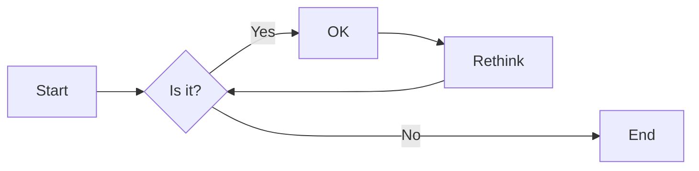

# 实验三 Python列表

班级： 21计科1

学号： B20210302132

姓名： 杨镇泽

Github地址：<https://github.com/Na7m1/python_course>

CodeWars地址：<https://www.codewars.com/users/Na7m1>

---

## 实验目的

1. 学习Python的简单使用和列表操作
2. 学习Python中的if语句

## 实验环境

1. Git
2. Python 3.10
3. VSCode
4. VSCode插件

## 实验内容和步骤

### 第一部分

Python列表操作

完成教材《Python编程从入门到实践》下列章节的练习：

- 第3章 列表简介
- 第4章 操作列表
- 第5章 if语句

---

### 第二部分

在[Codewars网站](https://www.codewars.com)注册账号，完成下列Kata挑战：

---

#### 第一题：3和5的倍数（Multiples of 3 or 5）

难度： 6kyu

如果我们列出所有低于 10 的 3 或 5 倍数的自然数，我们得到 3、5、6 和 9。这些数的总和为 23. 完成一个函数，使其返回小于某个整数的所有是3 或 5 的倍数的数的总和。此外，如果数字为负数，则返回 0。

注意：如果一个数同时是3和5的倍数，应该只被算一次。

**提示：首先使用列表解析得到一个列表，元素全部是3或者5的倍数。
使用sum函数可以获取这个列表所有元素的和.**

代码提交地址：
<https://www.codewars.com/kata/514b92a657cdc65150000006>

---

#### 第二题： 重复字符的编码器（Duplicate Encoder）

难度： 6kyu

本练习的目的是将一个字符串转换为一个新的字符串，如果新字符串中的每个字符在原字符串中只出现一次，则为"("，如果该字符在原字符串中出现多次，则为")"。在判断一个字符是否是重复的时候，请忽略大写字母。

例如:

```python
"din"      =>  "((("
"recede"   =>  "()()()"
"Success"  =>  ")())())"
"(( @"     =>  "))(("
```

代码提交地址:
<https://www.codewars.com/kata/54b42f9314d9229fd6000d9c>

---

#### 第三题：括号匹配（Valid Braces）

难度：6kyu

写一个函数，接收一串括号，并确定括号的顺序是否有效。如果字符串是有效的，它应该返回True，如果是无效的，它应该返回False。
例如：

```python
"(){}[]" => True 
"([{}])" => True
 "(}" => False
 "[(])" => False 
"[({})](]" => False
```

**提示：
python中没有内置堆栈数据结构，可以直接使用`list`来作为堆栈，其中`append`方法用于入栈，`pop`方法可以出栈。**

代码提交地址
<https://www.codewars.com/kata/5277c8a221e209d3f6000b56>

---

#### 第四题： 从随机三元组中恢复秘密字符串(Recover a secret string from random triplets)

难度： 4kyu

有一个不为你所知的秘密字符串。给出一个随机三个字母的组合的集合，恢复原来的字符串。

这里的三个字母的组合被定义为三个字母的序列，每个字母在给定的字符串中出现在下一个字母之前。"whi "是字符串 "whatisup "的一个三个字母的组合。

作为一种简化，你可以假设没有一个字母在秘密字符串中出现超过一次。

对于给你的三个字母的组合，除了它们是有效的三个字母的组合以及它们包含足够的信息来推导出原始字符串之外，你可以不做任何假设。特别是，这意味着秘密字符串永远不会包含不出现在给你的三个字母的组合中的字母。

测试用例：

```python
secret = "whatisup"
triplets = [
  ['t','u','p'],
  ['w','h','i'],
  ['t','s','u'],
  ['a','t','s'],
  ['h','a','p'],
  ['t','i','s'],
  ['w','h','s']
]
test.assert_equals(recoverSecret(triplets), secret)
```

代码提交地址：
<https://www.codewars.com/kata/53f40dff5f9d31b813000774/train/python>

提示：

- 利用集合去掉`triplets`中的重复字母，得到字母集合`letters`，最后的`secret`应该由集合中的字母组成，`secret`长度也等于该集合。

```python
letters = {letter for triplet in triplets for letter in triplet }
length = len(letters)
```

- 创建函数`check_first_letter(triplets, first_letter)`，检测一个字母是不是secret的首字母，返回True或者False。
- 创建函数`remove_first_letter(triplets, first_letter)`,  从三元组中去掉首字母，返回新的三元组。
- 遍历字母集合letters，利用上面2个函数得到最后的结果`secret`。

---

#### 第五题： 去掉喷子的元音（Disemvowel Trolls）

难度： 7kyu

喷子正在攻击你的评论区!
处理这种情况的一个常见方法是删除喷子评论中的所有元音(字母：a,e,i,o,u)，以消除威胁。
你的任务是写一个函数，接收一个字符串并返回一个去除所有元音的新字符串。
例如，字符串 "This website is for losers LOL!"   将变成 "Ths wbst s fr lsrs LL!".

注意：对于这个Kata来说，y不被认为是元音。
代码提交地址：
<https://www.codewars.com/kata/52fba66badcd10859f00097e>

提示：

- 首先使用列表解析得到一个列表，列表中所有不是元音的字母。
- 使用字符串的join方法连结列表中所有的字母，例如：

```python
last_name = "lovelace"
letters = [letter for letter in last_name ]
print(letters) # ['l', 'o', 'v', 'e', 'l', 'a', 'c', 'e']
name = ''.join(letters) # name = "lovelace"
```

---

### 第三部分

使用Mermaid绘制程序流程图

安装VSCode插件：

- Markdown Preview Mermaid Support
- Mermaid Markdown Syntax Highlighting

使用Markdown语法绘制你的程序绘制程序流程图（至少一个），Markdown代码如下：

显示效果如下：



查看Mermaid流程图语法-->[点击这里](https://mermaid.js.org/syntax/flowchart.html)

使用Markdown编辑器（例如VScode）编写本次实验的实验报告，包括[实验过程与结果](#实验过程与结果)、[实验考查](#实验考查)和[实验总结](#实验总结)，并将其导出为 **PDF格式** 来提交。

## 实验过程与结果

请将实验过程与结果放在这里，包括：

- [第一部分 Python列表操作和if语句](#第一部分)
- [第二部分 Codewars Kata挑战](#第二部分)

#### 第一题：3和5的倍数（Multiples of 3 or 5）
 ```
def solution(n):
    if n < 0:
        return 0

    multiples = []
    for i in range(1, n):
        if i % 3 == 0 or i % 5 == 0:
            multiples.append(i)

    return sum(multiples)
```
  

#### 第二题： 重复字符的编码器（Duplicate Encoder）
  ```def duplicate_encode(word):
    word = word.lower()

    new_word = ''
    
    for ch in word:
        if word.count(ch) == 1:
            new_word += '('
        else:
            new_word += ')'

    return new_word
   ```

    

 #### 第三题：括号匹配（Valid Braces）
   ```
   def valid_braces(s):
    stack = []
    mapping = {")": "(", "}": "{", "]": "["}

    for char in s:
        if char in mapping:
            top_element = stack.pop() if stack else '#'
            if mapping[char] != top_element:
                return False
        else:
            stack.append(char)

    return not stack
   ```

   

#### 第四题： 从随机三元组中恢复秘密字符串(Recover a secret string from random triplets)

```
def recoverSecret(triplets):
    adjacency_dict = {}
    unique_letters = set()

    for triplet in triplets:
        for i in range(2):
            if triplet[i+1] not in adjacency_dict:
                adjacency_dict[triplet[i+1]] = set()
            adjacency_dict[triplet[i+1]].add(triplet[i])
            unique_letters.add(triplet[i])
            unique_letters.add(triplet[i + 1])

    result = ""
    while unique_letters:
        for letter in unique_letters.copy():
            if letter not in [x for neighbors in adjacency_dict.values() for x in neighbors]:
                result = letter + result
                unique_letters.remove(letter)
                if letter in adjacency_dict:
                    del adjacency_dict[letter]

    return result
```

#### 第五题： 去掉喷子的元音（Disemvowel Trolls）
   ```
   def disemvowel(s):
    vowels = 'aeiouAEIOU'
    return ''.join([char for char in s if char not in vowels])
   ```

   


- [第三部分 使用Mermaid绘制程序流程图](#第三部分)


## 实验考查

请使用自己的语言并使用尽量简短代码示例回答下面的问题，这些问题将在实验检查时用于提问和答辩以及实际的操作。

1. Python中的列表可以进行哪些操作？
- 创建、访问、更新、删除、其它操作等
2. 哪两种方法可以用来对Python的列表排序？这两种方法有和区别？
- 两种对列表进行排序的方法是使用sorted()函数和列表的sort()方法。
- 两种方法的主要区别在于返回值。sorted()函数返回一个新的已排序列表，而sort()方法直接在原始列表上进行就地排序。
3. 如何将Python列表逆序打印？
- 使用列表的reverse()方法或者使用切片技巧。
4. Python中的列表执行哪些操作时效率比较高？哪些操作效率比较差？是否有类似的数据结构可以用来替代列表？
- 列表执行以下操作时效率比较高:访问元素、追加元素、切片操作
- 以下操作的效率较低：查找元素、插入和删除元素
- 可以考虑使用以下数据结构来替代列表：链表、双向队列
5. 阅读《Fluent Python》Chapter 2. An Array of Sequence - Tuples Are Not Just Immutable Lists小节（p30-p35）。总结该小节的主要内容。
- 元组与列表的区别：元组是不可变的序列，而列表是可变的序列。元组一旦创建其元素不可变，而列表允许添加、删除和修改元素。
- 元组的不可变性：元组的不可变性使得其在某些场景下具有优势，如作为字典的键、用于表示不可变数据（如时间戳）等。

## 实验总结

这次实验让我熟练掌握了python列表的使用，并在vscode中掌握通过markdown进行编辑实验文档